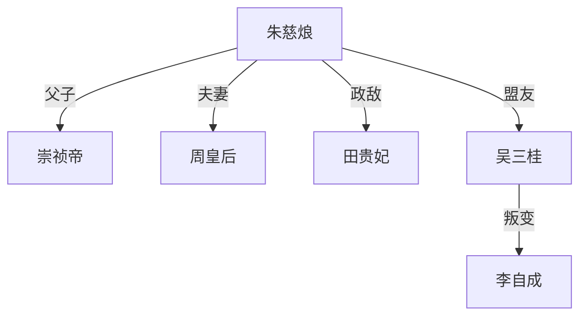

# 《大明挽歌：末代太子》创作指南

## 一、核心创作规范
### 1.1 历史真实性要求
- ✅ 允许调整：
  - 次要人物命运
  - 非关键时间点
  - 历史空白细节
- ❌ 禁止改动：
  - 重大历史事件结果
  - 主要人物基本性格
  - 典章制度核心内容

### 1.2 风格统一性
- 语言：70%文言+30%白话
- 视角：主视角+有限上帝视角
- 节奏：每章包含1个主要场景+2个过渡场景

## 二、章节写作模板
### 2.1 标准章节结构
```markdown
# 第X章 章节标题

**时间**：精确到月份  
**地点**：主要场景地点  
**POV人物**：视角人物  

## 核心事件
1. 事件起因
2. 冲突升级
3. 转折点
4. 暂时结果

## 人物发展
- 主角成长：
- 配角变化：

## 历史细节
- 需考证内容：
- 艺术加工点：
```

### 2.2 特殊章节要求
- 战争章节：需包含战术示意图
- 朝议章节：需列出发言人物立场
- 情感章节：需标注心理变化节点

## 三、人物关系图谱


## 四、时间线速查表
| 时间节点 | 历史事件 | 小说改编点 |
|---------|---------|-----------|
| 1643.10 | 清军入塞 | 增加太子巡边情节 |
| 1644.03 | 北京陷落 | 推迟15天 |
| 1644.05 | 南明建立 | 改变定都地点 |

## 五、常见问题解决方案
1. **历史与虚构冲突**：优先保留历史主干
2. **现代观念表达**：通过人物质疑而非直接陈述
3. **战争场面重复**：每次突出不同战术特点

## 六、创作进度管理
- 每日目标：16000字
- 章节周期：2章/1天
- 修订流程：
  1. 初稿写作
  2. 史实核查
  3. 文学润色
  4. 整体连贯性检查

## 七、参考资料清单
1. 《明史》中华书局版
2. 《南明史》顾诚
3. 《万历十五年》黄仁宇
4. 《明代军政研究》论文合集